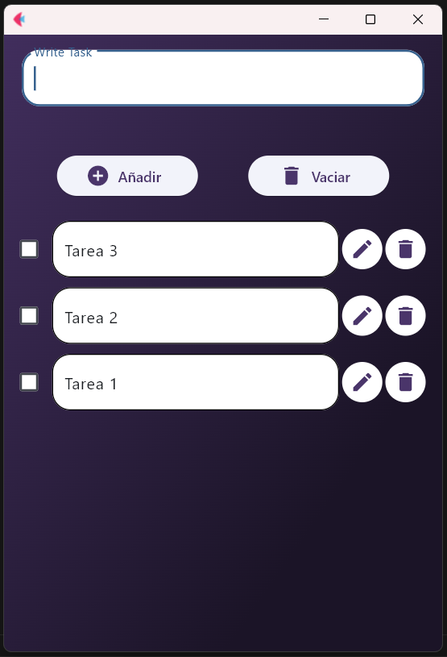

Este rograma es una practica para mejorr en programacion, es facil de usar y llevar el control de las tareas del día, estare mejorandolo un poco y le agregare una base de datos con mysql para gusrdar las notas cuando se cierre el programa.

